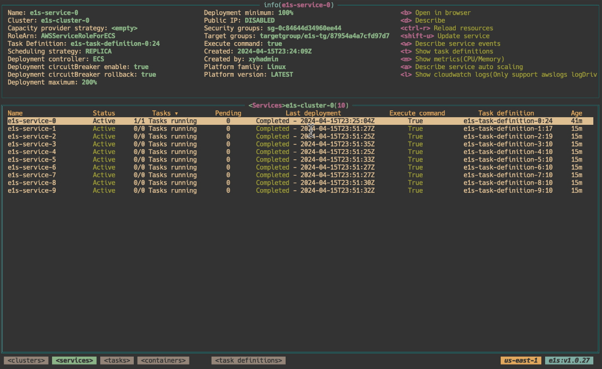
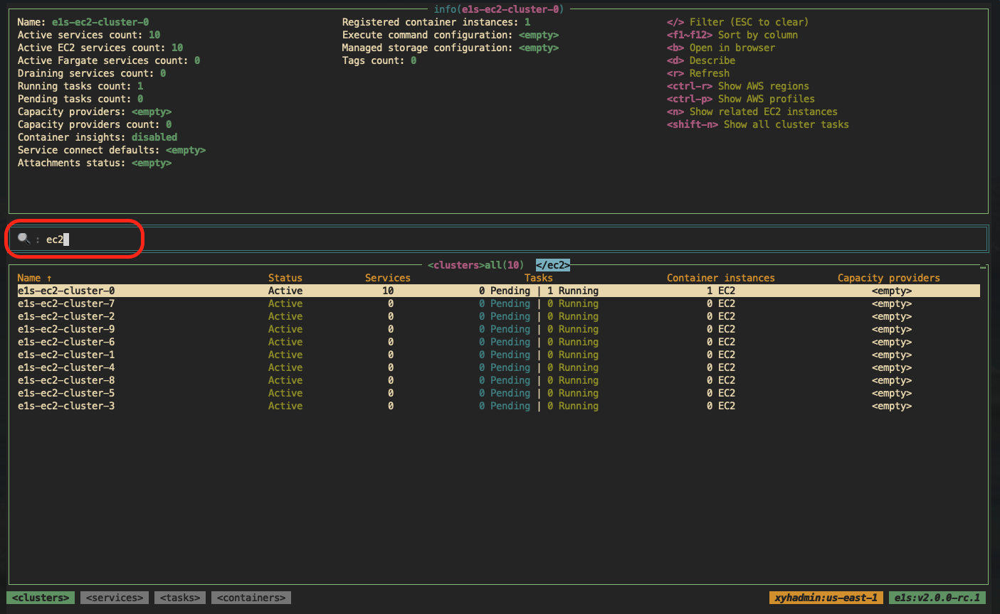
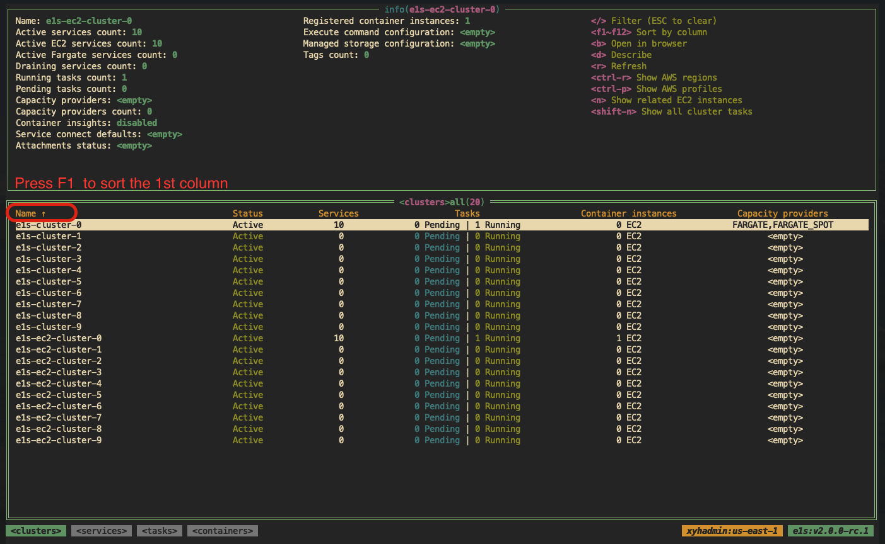

# a16s

A terminal UI for browsing AWS — ECS, Lambda, SQS, and DynamoDB — in one [k9s](https://github.com/derailed/k9s)-style interface.

`a16s` is a fork of [keidarcy/e1s](https://github.com/keidarcy/e1s) that keeps the ECS feature set intact and adds a `:` command palette for jumping between AWS services without leaving the terminal.

> **Status:** active development. ECS parity with upstream is preserved; Lambda, SQS, and DynamoDB are usable but not yet feature-complete. Expect breaking changes until the first tagged release.


<!-- TODO: record a 10-second asciinema of `:` → lambda → b (open in browser). Save to docs/img/palette.gif. -->

## Why a16s

- **One TUI for the most-used AWS services.** ECS, Lambda, SQS, and DynamoDB without flipping browser tabs.
- **Familiar k9s-style flow.** `:` to jump, vim keys to move, `?` for help.
- **Background preload.** First `:lambda` / `:sqs` / `:ddb` after the splash screen is instant on accounts with hundreds of resources.
- **Cross-kind jumps.** From a Lambda's DLQ, hit Enter to land on the matching SQS queue with the cursor pre-positioned.
- **Read-only by default if you want it.** `--read-only` disables every mutating action.

## Quick start

```bash
go install github.com/mohsiur/a16s/cmd/a16s@latest
a16s
```

Press `:` to open the palette and type a kind:

| Verb | Lands on |
|---|---|
| `:profiles` | AWS profile picker (default landing screen) |
| `:clusters` | ECS clusters → services → tasks → containers |
| `:lambdas` (alias `:lambda`) | Lambda functions |
| `:sqs` (alias `:queues`) | SQS queues |
| `:ddb` (aliases `:dynamodb`, `:tables`) | DynamoDB tables |
| `:exit` / `:quit` / `:q` | Leave the app |

`Tab` autocompletes among registered verbs. `Esc` cancels the palette.

## AWS credentials and configuration

`a16s` uses the standard [AWS CLI configuration](https://github.com/aws/aws-cli/blob/develop/README.rst#configuration) — it does not store, transmit, or rewrite your credentials. All AWS calls go through the official AWS SDK for Go.

Credentials and region can come from any of:

- The default AWS CLI profile (`AWS_PROFILE` and `AWS_REGION` env vars).
- CLI flags: `--profile`, `--region`.
- The in-app picker: `Ctrl+P` for profiles, `Ctrl+R` for regions.

`a16s` understands shared config and credentials files, including assume-role profiles, `credential_process`, and AWS IAM Identity Center / SSO. If your profile sets the region in `~/.aws/config` rather than the env var, `a16s` will resolve it from the config — useful for SSO-based workflows.

## Installation

`a16s` runs on Linux, macOS, and Windows (amd64 and arm64).

```bash
# go install (recommended while pre-release)
go install github.com/mohsiur/a16s/cmd/a16s@latest

# from source
git clone https://github.com/mohsiur/a16s.git
cd a16s
go build -o a16s ./cmd/a16s
```

Pre-built binaries, a Homebrew tap, and Docker images will follow once the fork stabilises and tags its first release. Until then, `go install` is the path of least surprise.

### Prerequisites

- Go 1.26+ (only for `go install` / building from source).
- AWS CLI credentials configured (any standard mechanism works).
- [Session Manager plugin](https://docs.aws.amazon.com/systems-manager/latest/userguide/session-manager-working-with-install-plugin.html) — required only if you plan to use ECS Exec or port forwarding.

## Usage

```
$ a16s -h
a16s is a terminal application to easily browse and manage AWS resources.

Usage:
  a16s [flags]

Flags:
      --cluster string       specify the default cluster
  -c, --config-file string   config file (default "$HOME/.config/a16s/config.yml")
  -d, --debug                sets debug mode
  -h, --help                 help for a16s
  -j, --json                 log output json format
  -l, --log-file string      specify the log file path (default "${TMPDIR}a16s.log")
      --profile string       specify the AWS profile
      --read-only            sets read only mode
  -r, --refresh int          default refresh rate (sec). -1 disables auto refresh. (default 30)
      --region string        specify the AWS region
      --service string       specify the default service (requires --cluster)
  -s, --shell string         interactive ecs exec shell (default "/bin/sh")
      --splash               display startup splash (AWS load runs before the UI) (default true)
      --theme string         specify color theme
  -v, --version              version for a16s
```

### Examples

```bash
# default: launches into the profile picker
a16s

# explicit profile + region
AWS_PROFILE=custom-profile AWS_REGION=us-east-2 a16s
a16s --profile custom-profile --region us-east-2

# skip the picker — open straight into a cluster's services
a16s --cluster my-cluster

# read-only, debug, no auto-refresh, custom log path, json logs, dracula theme
a16s --read-only --debug --refresh -1 --log-file /tmp/a16s.log --json --theme dracula

# disable startup splash
a16s --splash=false
```

## Feature tour

### ECS — clusters → services → tasks → containers

The original e1s flow. Drill in with `Enter` (or `l` / right arrow), back out with `Esc` (or `h` / left arrow).



Supported actions on ECS resources include:

- Describe (`d`) — clusters, services, deployments, revisions, tasks, containers, task definitions, autoscaling.
- Logs (`L`) — CloudWatch Logs tail, with real-time streaming when the service uses a single log group.
- Exec (`s` on a container) — interactive ECS Exec shell.
- Instance shell (`s` on a container instance) — SSM Session Manager.
- Port forwarding (`F`) — local + remote host port forwarding via SSM.
- Update service (`U`) — change desired count, force new deployment, swap task definitions.
- Stop task (`S`) — with confirmation modal.
- Register task definition (`U` on a task def) — pull, edit, register a revision.
- File transfer (`P` on a container) — push and pull files through S3.


### Lambda

`:lambdas` lists every function in the active region. Per-function actions:

- `Enter` or `L` — tail CloudWatch Logs. Use `f` to drop the TUI and read the log in your `$PAGER` (defaults to `less -R`) so the whole stream can be copied.
- `i` — invoke with a JSON payload (read-only mode disables this).
- `D` — jump to the function's DLQ in `:sqs`.
- `b` — open the function in the AWS console.
- `d` — describe (full configuration JSON).

<!-- TODO: docs/img/lambda.png -->

### SQS

`:sqs` lists queues with message counts, in-flight, delay, and DLQ flag.

- `Enter` — peek the first batch of messages without affecting consumers (uses `VisibilityTimeout=0`).
- `s` — send a test message.
- `p` — purge (with confirmation).
- `b` — open the queue in the AWS console.
- `d` — describe (URL + queue attributes).

<!-- TODO: docs/img/sqs.png -->

### DynamoDB

`:ddb` lists tables. Drill in to view indexes, then scan items.

- Table → indexes — base table first, then GSIs (alphabetical), then LSIs.
- Index → items — first column is the partition key, second is the sort key (when present), then the rest alphabetically.
- `q` on an index — query (form-based).
- `b` — open the table in the AWS console (works on table, index, and item views).

<!-- TODO: docs/img/ddb.png -->

### Navigation, filter, sort

- Vim keys: `h` `j` `k` `l` ↔ left, down, up, right. Arrow keys also work.
- `/` — text filter. Supports `column:value` syntax. `Esc` clears.
- `F1`–`F12` — sort by column index. Repeat to flip direction.
- `:` palette — `Tab` autocompletes, `Esc` cancels.
- `Ctrl+P` / `Ctrl+R` — switch profile / region without leaving the app.




### Themes

Themes can be picked by name (`--theme dracula`) or fully overridden in the config file. The Alacritty theme list works as a starting palette.

```yml
theme: dracula
colors:
  BgColor: "#272822"
  FgColor: "#f8f8f2"
  BorderColor: "#a1efe4"
  Red: "#f92672"
  Green: "#a6e22e"
  Yellow: "#f4bf75"
  Blue: "#66d9ef"
  Magenta: "#ae81ff"
  Cyan: "#a1efe4"
  Gray: "#808080"
```


### Config file

Default path: `$HOME/.config/a16s/config.yml`. Override with `--config-file`. `a16s` uses [viper](https://github.com/spf13/viper), so any viper-supported format is accepted.

Common settings:

- `theme`, `colors`
- `refresh` — auto-refresh interval, `-1` to disable
- `read-only`
- `log-file`, `json`, `debug`
- `cluster`, `service` — default ECS targets
- `splash`

### Key bindings (top-level)

| Key | Action |
|---|---|
| `?` | Help page (full key reference) |
| `:` | Open kind palette |
| `Esc` / `h` / `←` | Back / cancel (terminates at profile picker) |
| `Enter` / `l` / `→` | Drill in / select |
| `/` | Filter table |
| `F1`–`F12` | Sort by column |
| `r` | Refresh current view |
| `d` | Describe selected resource |
| `b` | Open in AWS console |
| `c` | Copy page name / content to clipboard |
| `Ctrl+P` | Switch AWS profile |
| `Ctrl+R` | Switch AWS region |

Press `?` inside the app for the full, kind-aware list.

## Development

```bash
# run from source
go run ./cmd/a16s --debug --log-file /tmp/a16s.log

# tail logs in another tab
tail -f /tmp/a16s.log

# tests
go test ./...

# vet
go vet ./...
```

The `internal/view` package owns the TUI and per-kind plumbing. Each AWS service has a dedicated file (`lambda.go`, `sqs.go`, `dynamodb.go`) plus a kind registration that wires it into the `:` palette.

## Acknowledgements

`a16s` is a fork of [keidarcy/e1s](https://github.com/keidarcy/e1s). The ECS browsing experience, the k9s-inspired chrome, and most of the screenshots above are upstream work — credit to Xing Yahao and the e1s contributors. The multi-service palette, Lambda / SQS / DynamoDB views, and per-kind plumbing are this fork's additions.

## Thanks

- [tview](https://github.com/rivo/tview)
- [k9s](https://github.com/derailed/k9s)
- [keidarcy/e1s](https://github.com/keidarcy/e1s)
- [ecsview](https://github.com/swartzrock/ecsview)
